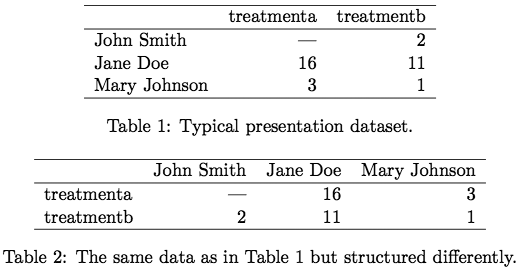
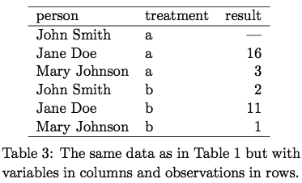
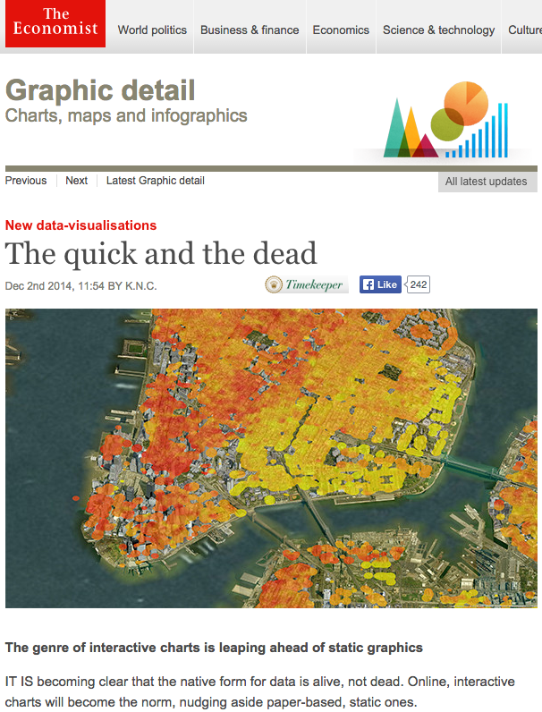

```{r knitr_setup, echo=FALSE}
knitr::opts_chunk$set(fig.width = 8, fig.height = 6,
					  dpi = 300, fig.cap="", fig.align='center')
showtext::showtext.opts(dpi = 300)
```

```{r loadbib, echo=FALSE, cache=FALSE}
library(RefManageR)
bib = ReadBib("references.bib", check = FALSE)
BibOptions(check.entries = FALSE, style = "markdown",
		   cite.style = "authoryear", bib.style = "numeric")
```


# How to access these slides
## (and associated code)

### Via git:

```{bash, eval=FALSE}
git clone https://github.com/saraemoore/Rdataviz2017.git
```

### Download directly:
https://github.com/saraemoore/Rdataviz2017/archive/master.zip

### View online:
http://saraemoore.github.io/Rdataviz2017

???

* I won't be showing all the code on the slides today, but it's all available in the R Markdown document used to create these slides in this repository on github.

---

# Prerequisites

You have:
* a working knowledge of R,
* some familiarity with the usage of `ggplot2` (such as what was presented during the [2016 UC Berkeley SCF/D-Lab R Bootcamp](https://github.com/berkeley-scf/r-bootcamp-2016)),
* an interest in creating data visualizations in R, both **static** (mostly using *ggplot2*) and **interactive** (using a variety of packages).

---
class: inverse, middle, center

# `ggplot2` and the Grammar of Graphics

---

# Why `ggplot`?

* It's pretty.
* Its commands are intuitive and "human-readable."
* Nearly any graphic can be created, so you can use it for everything and maintain a consistent style.
* It has (sort of) built-in support for maps.

???

* If you're here, you're probably already using ggplot or are interested in learning to use it. But, I'm still going to tell you why it's a good thing to use.
* Of course, it's pretty. Graphics made with ggplot are eye-catching.  This is actually pretty important -- it goes a long way when you want anyone who is not a statistician to look at your graphs.
* The code you use to call ggplot and create a graphic is fairly intuitive.  This is because of the "grammar of graphics" that it adheres to, and we'll get back to that in a bit. This is what the "gg" in "ggplot" stands for -- "grammar of graphics" -- so the philosophy is pretty central to the package.
* If you learn how to use it well, you can make almost any visualization in it, and your reports, presentations, papers, and so on will look more cohesive because you stuck to a particular style throughout.
* Finally, with a little help from other R packages, ggplot is able to interface with geographical maps.

---

# Why not `ggplot`?

* It's slow.
* It won't do some things.
* There's a steep learning curve.
* ~~`lattice` is better at trellis graphs?~~ [Faceting](https://learnr.wordpress.com/2009/08/26/ggplot2-version-of-figures-in-lattice-multivariate-data-visualization-with-r-final-part/) is just as powerful.

???

* So, what are the arguments against ggplot?
* It's slower than other R graphics systems. This is a fair point. However, it's probably not something you'll notice under everyday use.
* It also won't draw some graphics that you might want it to. One example that's often brought up is 3D surface plots. But, do you really want to make a static 3D perspective plot? There are other, arguably better, ways to represent three-dimensional data in 2D, like contour plots and heatmaps. This is kind of the story with most things that ggplot supposedly "can't" do -- it's a principled decision by a designer to limit the use of his product -- artistic license. For example, having two y-axes, each using a different scale for a different variable, is difficult if not impossible to do in ggplot -- which may be for the best because having two y-axes can be misleading. Moving x-axis labels to the top, rather than the bottom, is difficult but can be done. ggplot also refuses to use more than six shapes -- citing difficultly in determining which is which -- unless you manually override this by specifying your own shapes.
* ggplot can be difficult to break into. If you force yourself to use it, it will become natural fairly quickly, though. You can also start with qplot aka "quick plot," but I won't be going over that here.
* Some people argue that lattice is better at trellis graphs, which were made popular by William Cleveland's 1993 book "Visualizing Data." However, I disagree. I've included a link here to a compilation of a series of blog posts from 2009 in which nearly every graphic in the entire Lattice book by Deepayan Sarkar was recreated in ggplot. You can tweak these examples to make them look even more like lattice output, if you want, but the point is that faceting works just as well.

---

# Tidy data <sup>1</sup>

1. Each variable forms a column.
2. Each observation forms a row.
3. Each type of observational unit forms a table.

.pull-left[



]

.pull-right[



]


.footnote[1: `r TextCite(bib, "Wickham_2014")`]

???

* One stumbling block when getting started with ggplot is that your data needs to be in a certain format before you can use it in ggplot effectively.  One name for this format is "tidy data." It can also be called long or tall, as opposed to wide, data, but tidy data is a particular type of long data.  The general idea is that there should be one row per observation, whatever you're calling a single observation for your purposes, and one column per variable.  This means that you're typically going to want to collapse indicators into factors, for example, or you may need to think carefully about what your observational unit is.
* Here, the first two tables display data that is not tidy. The third table displays the same data, but made tidy.

---

# The (Layered) Grammar of Graphics <sup>1</sup>

* Move away from using "names" and "chart typologies."
* Instead, use "statements" constructed via grammar
* Why?
    + An infinite number of unique graphics can be created.
    + The implementation is **DRY** ("don't repeat yourself") not **WET** ("write everything twice" or "we enjoy typing").

> "Good grammar is just the first step in creating a good sentence." &nbsp;<sup>2</sup>

.footnote[1: `r TextCite(bib, c("Wilkinson_2005", "Wickham_2009", "Wickham_2010"))`<br />2: `r TextCite(bib, "Wickham_2010")`]

???

* As I mentioned previously, one of the best qualities of ggplot is that a series of commands used to generate a graphic are human-readable.  This is because ggplot adheres to the so-called "grammar of graphics," first laid out by Leland Wilkinson in 1999. The general idea is, instead of using a "name," "chart typology," or drawing from what Hadley Wickham calls a "big collection of special cases," think more abstractly and use a "statement" to describe a graphic -- and we need a grammar to construct statements. This infinitely expands the number of unique graphics that can be created and it adheres to the **DRY** ("don't repeat yourself") programming principle (as opposed to WET, "write everything twice" or "we enjoy typing")
* Hadley Wickham's quote from his 2010 paper on his take grammar of graphics is just meant to say that this is not a recipe for a perfect graphic -- you can still make some pretty poor visualizations with ggplot -- but it is the first step.

---

# Components of the Grammar

Specify a statistical graphic using components of statements:
+ **Data** (`data`),
+ **Stat**istical transformations (`stat_*`: identity, count, mean, etc.),
+ **Geom**etric elements/objects (`geom_*`: points, lines, etc.),
+ **Aes**thetic mappings (`aes` and `aes_*`: color, shape, size, transparency, etc.),
+ **Coord**inate systems (`coord_*`: cartesian, polar, map, etc.),
+ **Guide**s/Legends (`guide_*`, `guides`),
+ **Scale**s/Axes and transformations thereof (`scale_*`),
+ **Facet**ing/conditioning/latticing/trellising (`facet_*`),
+ Tweaking graphical positioning and visual elements (`position_*`, `annotation_*`, `theme`, `element_*`, etc.), and
+ Layering.

???

* The general concepts or classes, which are kind of a mash-up of Wilkinson's and Wickham's philosophies, are listed here. The realizations of these concepts in `ggplot` are in parentheses so we can connect the ideas to the R commands. Also, layering is not a statement itself, but is implied by the order of the other components.

---

# The anatomy of a `ggplot` call

* All arguments to the first function called, `ggplot`, set graph defaults.
* These defaults can be changed for an individual layer (even `data`).

```{r fakeggplot1, eval=FALSE}
ggplot(data=, aes(x=, y=, ...)) +
	geom_????(...) +
	...
```
```{r fakeggplot2, eval=FALSE}
ggplot() +
	geom_????(data=, aes(x=, y=, ...), ...) +
	...
```

???

* Some guides, including the ggplot book, start you off with the qplot or "quick plot" command. That's nice if you're coming from another graphics framework like base graphics in R. But, in the interest of time, because I'm assuming a little bit of familiarity with ggplot with this group, and because the ggplot command is more powerful than qplot, I'm going to skip right to using the ggplot command here.
* These are some simple examples of the ways in which you would create a very simple graph using ggplot. Any aesthetics or data you provide to the ggplot command, which always gets called first in the "statement," set defaults for the entire graph. You can instead choose to leave the ggplot command empty -- without arguments -- if you'd like to specify individual data and aesthetics for each geometric object. You can even specify a defaults AND specify different settings for individual geometric elements. Note that it is best practice to not repeat yourself, so typically you'll set some defaults up front and only change later in the statement any individual elements that you want to change.

---

# When geoms transform

geom                | stat                |  notable default settings
------------------- | ------------------- | -------------------
`geom_boxplot()`    | `stat_boxplot()`    | max length of whiskers (beyond hinges) = 1.5*IQR
`geom_count()`      | `stat_sum()`        |
`geom_bar()`        | `stat_count()`      |
`geom_histogram()`  | `stat_bin()`        | 30 bins: binwidth = [range of x]/30
`geom_freqpoly()`   | `stat_bin()`        | 30 bins: binwidth = [range of x]/30
`geom_dotplot()`    |                     | 30 bins: binwidth = [range of x]/30; Wilkinson's "dot-density" binning method
`geom_bin2d()`      | `stat_bin_2d()`     | 30 bins for each of x and y
`geom_hex()`        | `stat_bin_hex()`    | 30 bins for each of x and y (calls `hexbin::hexbin()`)

???

* Some geometric objects are straightforward. Others involve statistical transformations.
* On this slide and the next is a reference list of the geometric elements in ggplot that "silently" transform data by default, i.e. their default stat is not "identity." Also listed here are the defaults of those transformations. Although I called a "stat" function earlier that, by default, created a "geom", it is much more common in practice to just call a "geom" and add arguments specifying the "stat".
* The boxplot is a special case where many elements cannot be set by the user, but that's alright because they're what you'd expect them to be. The middle line is the median and the lower and upper hinges represent the lower and upper quartiles, respectively. The one thing you can specify is how far - at a maximum - the whiskers extend beyond the hinges, but the default (1.5 x inter-quartile range) is consistent with John Tukey's boxplot. You can also make a notched boxplot with geom_boxplot, and the notch locations are not specifiable, but I won't go into the settings for that here -- you can find it in the documentation if you're interested.

---

# When geoms transform

geom                | stat                |  notable default settings
------------------- | ------------------- | -------------------
`geom_density_2d()` | `stat_density_2d()` | bivariate Gaussian kernel; bandwidths (x and y) estimated by `MASS::bandwidth.nrd()` using Scott's "rule of thumb"; 100 grid points for x and y (calls `MASS::kde2d()`)
`geom_contour()`    | `stat_contour()`    | 10 `pretty()` breakpoints covering [range of z]
`geom_density()`    | `stat_density()`    | Gaussian kernel; bandwidth estimated by `stats::bw.nrd0()` using Silverman's "rule of thumb" (calls `stats::density()`)
`geom_violin()`     | `stat_ydensity()`   | Gaussian kernel; bandwidth estimated by `stats::bw.nrd0()` using Silverman's "rule of thumb" (calls `stats::density()`); all violins have same area before trimming tails, tails are trimmed to [range of y]

---

# When geoms transform

geom                | stat                |  notable default settings
------------------- | ------------------- | -------------------
`geom_smooth()`     | `stat_smooth()`     | if $n<1000$, `stats::loess()` with polynomial degree 2, $\alpha=0.75$, etc.; else, `gam::gam()` with penalized cubic regression splines, etc.; 80 evaluation points <br/>
`geom_quantile()`   | `stat_quantile()`   | 3 quartiles; modified Barrodale & Roberts quantile regression method (calls `quantreg::rq()`)

???

* For one and two dimensional kernel density estimates, by default, the bandwidth is chosen automatically via Scott's "rule of thumb," which I won't go into here, but the formula is available in the R help via the functions I've listed here. For two dimensional density estimates, the kernel cannot be changed to anything other than Gaussian.
* For loess and gam I only listed the most interesting parameters -- there are more that you can set. Just know that the "et cetera" indicates that any defaults not listed here for these functions are not modified in ggplot's call.
* FYI, violin plots were the big culprit for derailing the job talk a couple of years ago. As you can see, they're a bit tricky.

---

# Other `ggplot` transformations

These `stat_*` functions do not have assumed `geom_*` mappings. See their documentation for details of the transformations applied.

* `stat_ecdf`: Empirical Cumulative Density Function
* `stat_ellipse`: Plot data ellipses.
* `stat_function`: Superimpose a function.
* `stat_qq`: Calculation for quantile-quantile plot.
* `stat_spoke`: Convert angle and radius to xend and yend.
* `stat_summary`: Summarise y values at every unique x.
* `stat_summary_bin`: Summarise y values at unique/binned x.
* `stat_summary_hex`: Apply function for 2D hexagonal bins.
* `stat_summary_2d`: Apply function for 2D rectangular bins.
* `stat_unique`: Remove duplicates.
* `stat_identity`

---

# Where to go for help with `ggplot2`

* [RStudio's ggplot2 cheat sheet](https://www.rstudio.com/wp-content/uploads/2016/11/ggplot2-cheatsheet-2.1.pdf) (updated for ggplot2 v2.1.0, Nov 2016)
* [Hadley Wickham's ggplot2 book (2009)](http://link.springer.com/book/10.1007%2F978-0-387-98141-3), the book's [github repo](https://github.com/hadley/ggplot2-book), or the [companion website](http://ggplot2.org/book/) to the book
* [official documentation](http://docs.ggplot2.org/current/)
* [google group](https://groups.google.com/forum/#!forum/ggplot2)
* [ggplot2 on stackoverflow](http://stackoverflow.com/tags/ggplot2/info)
* The [data visualisation](http://r4ds.had.co.nz/data-visualisation.html) and [graphics for communication](http://r4ds.had.co.nz/graphics-for-communication.html) chapters in Garrett Grolemund and Hadley Wickham's [R for data science](http://r4ds.had.co.nz/).
* Winston Chang's R Graphics Cookbook, [1st edition (2012)](http://shop.oreilly.com/product/0636920023135.do) or forthcoming 2nd edition (2017)

---
class: inverse, middle, center

# `ggplot2` Examples

---

# The data

* [WHO Global Health Observatory](www.who.int/gho/en/)
* Example:

```{r whodataexample, eval=FALSE}
library(WHO)
codes <- get_codes()
who_data <- get_data("WHS9_CBR")
```

```{r getcodes, cache=TRUE, echo=FALSE, message=FALSE}
library(WHO)
codes <- get_codes(extra = TRUE)
```

```{r exploredata, echo=FALSE, eval=FALSE}
categoryWHOcodes <- function(who_cat, all_codes) {
	as.data.frame(subset(all_codes,
						 category==who_cat,
						 select = c(label, display)))
}

unique(codes$category)

categoryWHOcodes("Demographic and socioeconomic statistics", codes)
categoryWHOcodes("Injuries and violence", codes)
categoryWHOcodes("Sustainable development goals", codes)
categoryWHOcodes("Mortality and global health estimates", codes)
```

```{r grabdata, echo=FALSE, cache=TRUE}
getWHOdataByLabels <- function(who_labels) {
	who_data = lapply(who_labels, get_data)
	names(who_data) = who_labels
	# remove empty datasets
	no_data = (lapply(who_data, nrow)==0)
	if(any(no_data)) {
		who_data = who_data[-unname(which(no_data))]
	}
	return(who_data)
}

labelWHOcodes <- function(selected_labels, all_codes) {
	as.data.frame(subset(all_codes,
						 label%in%selected_labels,
						 select = c(label, display)))
}
makeWHOnamevec <- function(selected_labels, all_codes) {
	selected_codes <- labelWHOcodes(selected_labels, all_codes)
	# make a name lookup table
	selected_names = selected_codes$display
	names(selected_names) = selected_codes$label
	return(selected_names)
}

data_labels = c("WHS9_CBR", "WHS9_CDR", "MDG_0000000001", "MDG_0000000026", "WHS2_126")

who_data = getWHOdataByLabels(data_labels)
who_names = makeWHOnamevec(names(who_data), codes)
```

```{r cleandata, echo=FALSE, cache=TRUE, warning=FALSE, message=FALSE}
library(dplyr)

splitValueCol = function(df_col, split_on) {
	bind_rows(lapply(df_col, function(x) as.data.frame(t(as.numeric(unlist(strsplit(split = split_on, x)))))))
}
splitValueColNames = c("value", "value_lower", "value_upper")

who_data[["MDG_0000000001"]][,splitValueColNames] <- splitValueCol(
	as.data.frame(who_data[["MDG_0000000001"]])$value,
	"[[:space:]]\\[|-|\\]")

# get rid of pesky spaces
who_data[["MDG_0000000026"]]$value = gsub("(\\d+)\\s+(\\d+)", "\\1\\2", who_data[["MDG_0000000026"]]$value)
who_data[["MDG_0000000026"]][,splitValueColNames] <- splitValueCol(
	as.data.frame(who_data[["MDG_0000000026"]])$value,
	"[[:space:]]\\[[[:space:]]|[[:space:]]-[[:space:]]+|\\]")

# quick and dirty way to make all strings into factors
who_data = lapply(who_data, function(x) as.data.frame(unclass(x)))

who_cbdr = merge(who_data[["WHS9_CBR"]], who_data[["WHS9_CDR"]],
				 by = c("year", "worldbankincomegroup", "country", "region"),
				 all = TRUE,
				 suffixes = c(".birthsper1000",".deathsper1000"))

who_mort = merge(who_data[["MDG_0000000001"]], who_data[["MDG_0000000026"]],
				 by = c("year", "country", "region"),
				 all = TRUE,
				 suffixes = c(".infant", ".maternal"))
who_mort[,c("value.infant", "value_lower.infant", "value_upper.infant")] = who_mort[,c("value.infant", "value_lower.infant", "value_upper.infant")]/1000
who_mort[,c("value.maternal", "value_lower.maternal", "value_upper.maternal")] = who_mort[,c("value.maternal", "value_lower.maternal", "value_upper.maternal")]/100000

# http://apps.who.int/gho/indicatorregistry/App_Main/view_indicator.aspx?iid=90
who_yllmajorcause = as.data.frame(subset(who_data[["WHS2_126"]], year==2012) %>%
						   group_by(region, ghecauses) %>%
						   summarise(med.pct = median(value)))
```

* Alternatively, use data that ships with `ggplot2`:
    + [diamonds](http://docs.ggplot2.org/current/diamonds.html),
    + [mpg](http://docs.ggplot2.org/current/mpg.html),
    + movies (now available as a separate R package, [ggplot2movies](https://CRAN.R-project.org/package=ggplot2movies)),
    + etc.

???

* WHO GHO
* If you don''t want to go to this trouble, ggplot2 ships with several good datasets that you can use instead -- a few of them are listed here. You can try your hand with one of those if you want some practice.

---

# A simple scatterplot

```{r simple_scatterplot0, message=FALSE, eval=FALSE}
library(ggplot2)
p = ggplot(data = subset(who_cbdr, !is.na(country)),
		aes(x = value.birthsper1000,
			y = value.deathsper1000,
			color = worldbankincomegroup)) +
	geom_point()
p
```

???

* This is a simple example to get us started. Here we have DATA which contains all the NCAA basketball games played over 30 seasons between 1984 and 2014. Each row is an observation, as we''ve defined it for this problem -- a single basketball game. Each column is a variable. This data is tidy, at least for how we choose to represent it now -- but there are other ways to structure it.
* There are no implicit or explicit transformations of the data going on, and the only aesthetics are the position of each point in two dimensional space, defined by x and y. The geometric objects here are points, which are displayed in ggplot by default as circles. And, because it''s just good practice, we''ve tweaked some visual elements, adding labels to each axis and a title to the graph.

---

class: fullscreen, middle, center

```{r simple_scatterplot1, ref.label="simple_scatterplot0", message=FALSE, echo=FALSE, cache=FALSE, warning=FALSE}
```

???

* All that said, this is not a great graphic.  We can tell that, obviously, the winning team always scored as many or more points than the losing team, and it seems like there might be many games where the score was close, but it's difficult to tell because of all the overplotting. I'm not going to dwell too much on what a good versus bad plot is -- you'll know that from other classes, like Professor Dudoit's Computational Statistics course, but I just wanted to point that out here as a segue to the next graphic.

---

# Reorder a group aesthetic

```{r levels_scatterplot}
levels(who_cbdr$worldbankincomegroup)
```

```{r grouporder_scatterplot0, eval=FALSE}
# reorder factor levels
who_cbdr$worldbankincomegroup = factor(
	who_cbdr$worldbankincomegroup,
	levels = levels(who_cbdr$worldbankincomegroup)[c(2, 5:3, 1)],
	labels = c("High", "Upper-middle", "Lower-middle", "Low", "Global"))

# recreate plot with modifed data
p = p %+% subset(who_cbdr, !is.na(country))
p
```

---

class: fullscreen, middle, center

```{r grouporder_scatterplot1, ref.label="grouporder_scatterplot0", message=FALSE, echo=FALSE, cache=FALSE, warning=FALSE}
```

---

# Add labels

```{r label_scatterplot0, eval=FALSE}
p = p +
	xlab("Crude birth rate") +
	ylab("Crude death rate") +
	labs(title = "Global population rates",
		 subtitle = "2013; per 1,000 population",
		 caption = "Source: UN World Population Prospects (https://esa.un.org/unpd/wpp/)") +
	theme(plot.title = element_text(hjust = 0.5),
		  plot.subtitle = element_text(hjust = 0.5),
		  plot.caption = element_text(size = 8))
p
```

* `ggtitle()` can instead be used to set the title and subtitle
* `scale_x_*()` and `scale_y_*()` can instead be used to set the x and y axis labels, respectively.
* As of ggplot2 v2.2.0, title(s) are left-aligned by default.

???

* The crude birth rate is generally computed as a ratio. The numerator is the number of live births observed in a population during a reference period and the denominator is the number of person-years lived by the population during the same period. It is expressed as births per 1,000 population.

---

class: fullscreen, middle, center

```{r label_scatterplot1, ref.label="label_scatterplot0", message=FALSE, echo=FALSE, cache=FALSE, warning=FALSE}
```

---

# Improve legend and colors

```{r legend_scatterplot0, eval=FALSE}
p = p +
	scale_colour_brewer("World Bank Income Group",
						palette = "Dark2") +
	theme(legend.position = "bottom")
p
```

* For discrete/qualitative color schemes: `scale_colour_hue()`, `scale_colour_discrete()`, `scale_colour_brewer()`, `scale_colour_grey()`, `scale_colour_manual()`, `scale_colour_identity()`
* For continuous (sequential or diverging) color schemes: `scale_colour_continuous()`, `scale_colour_distiller()`, `scale_colour_gradient()`, `scale_colour_gradient2()`, `scale_color_gradientn()`, `scale_colour_date()`, `scale_colour_datetime()`
---

class: fullscreen, middle, center

```{r legend_scatterplot1, ref.label="legend_scatterplot0", message=FALSE, echo=FALSE, cache=FALSE, warning=FALSE}
```

---

# R color palette packages

- [RColorBrewer](https://CRAN.R-project.org/package=RColorBrewer) ([palette browser](http://colorbrewer2.org)): custom color palettes with colorblind friendly, print-friendly, and photocopy-friendly options
- [munsell](https://github.com/cwickham/munsell): called by `scales` to generate continuous/gradient palettes in `ggplot2`
- [colorspace](https://CRAN.R-project.org/package=colorspace): color palettes based on the HCL (Hue-Chroma-Luminance) and HSV (Hue-Saturation-Value) systems
- [viridis](https://github.com/sjmgarnier/viridis): color schemes from Matplotlib (Python plotting library)
- [dichromat](https://CRAN.R-project.org/package=dichromat) ([palette browser](http://geography.uoregon.edu/datagraphics/color_scales.htm): color palettes for color-impaired viewers
- [pals](https://github.com/kwstat/pals): color palettes and palette evaluation tools
- [ggsci](https://github.com/road2stat/ggsci/): color palettes inspired by scientific journals, dataviz libraries, scifi movies, TV shows
- [wesanderson](https://github.com/karthik/wesanderson): self-explanatory ([tumblr inspiration](http://wesandersonpalettes.tumblr.com/))
- [scales](http://cran.r-project.org/web/packages/scales/index.html): additional functions to deal with ggplot `scale`s, including color palettes
- $\ldots$

---

# Add a summary (or two)

```{r summary_scatterplot0, eval=FALSE}
p = p +
	stat_ellipse(type = "t", level = 0.9,
				 segments = 80, alpha = 0.5) +
	 geom_smooth(aes(color = NULL), method = "loess",
	 			 span = 0.6, se = FALSE,
	 			 color = "grey40", linetype = "longdash")
p
```

* An alternative way to map an aesthetic to only some layers: specify the mapping in each layer but not in the call to `ggplot`.

---

class: fullscreen, middle, center

```{r summary_scatterplot1, ref.label="summary_scatterplot0", message=FALSE, echo=FALSE, cache=FALSE, warning=FALSE}
```

---

# Tweak the theme and font

```{r theme_scatterplot0, eval=FALSE}
old_theme = theme_set(theme_minimal(base_size = 14))
p
```

* Theme options: `theme_gray()`, `theme_bw()`, `theme_linedraw()`, `theme_light()`, `theme_dark()`, `theme_minimal()`, `theme_classic()`, `theme_void()`
* Alternatively, the call to `theme_minimal()` above could be "added" to the plot `p`. However, this would wipe out previous changes made to `p` via `theme()`.

---

class: fullscreen, middle, center

```{r theme_scatterplot1, ref.label="theme_scatterplot0", message=FALSE, echo=FALSE, cache=FALSE, warning=FALSE}
```

---

# `ggplot2` theme packages

- [ggthemes](https://github.com/jrnold/ggthemes): extra `geom`s, `scale`s, and `theme`s for use with `ggplot2`
- [hrbrthemes](https://github.com/hrbrmstr/hrbrthemes): typography-centric themes for `ggplot2`
- [xkcd](https://CRAN.R-project.org/package=xkcd): `ggplot2` plot theme in the style of XKCD comics
- [ggplot2bdc](https://github.com/briandconnelly/ggplot2bdc): 'clean' and specialized themes + additional useful functions
- [ggthemr](https://github.com/cttobin/ggthemr): themes with predefined color palettes and options to modify other elements
- $\ldots$

---

# Tweak the theme and font

```{r font_scatterplot0, eval=FALSE}
library(showtext)
sysfonts::font.add.google("Open Sans", "open_sans")
showtext::showtext.auto()
p = p + theme(text = element_text(family = "open_sans"))
p
```

* To use a font installed on the local system, call `font.add()` instead.
* Can instead set font via `base_family` argument of any `theme_*()` function.
* Turn off use of `showtext`: `showtext.auto(FALSE)`
* Alternatively, use `showtext.begin()` and `showtext.end()` to only turn on `showtext` as desired
* See [this blog post](http://statr.me/2014/07/showtext-with-knitr/) for details on using `showtext` with `knitr`
    * The author recommends [`Cairo`](https://CRAN.R-project.org/package=Cairo) graphics devices for raster output due to sub-par antialiasing with default devices. YMMV

---

class: fullscreen, middle, center

```{r font_scatterplot1, ref.label="font_scatterplot0", fig.showtext=TRUE, message=FALSE, echo=FALSE, cache=FALSE, warning=FALSE}
```

---

# Font packages

.pull-left[

**Access system/Google/etc. fonts:**

- [showtext](https://github.com/yixuan/showtext): Easily use alternative fonts in R plots. Allows resulting (vector) graphics files to be font-independent.
- [sysfonts](https://github.com/yixuan/sysfonts): Companion package to [showtext](https://github.com/yixuan/showtext). Loads system and Google fonts.
- [extrafont](https://github.com/wch/extrafont): Use system TrueType fonts in R plots. Embeds fonts in resulting (vector) graphics files. A little more work to use but resulting files should retain text editability.
- [tikzDevice](https://github.com/yihui/tikzDevice): $\LaTeX$-friendly R graphics output

]

.pull-right[

**Emoji/icons/custom images:**

- [emojifont](https://github.com/GuangchuangYu/emojifont)
- [emoGG](https://github.com/dill/emoGG)
- [ggimage](https://github.com/GuangchuangYu/ggimage)
- [ggflags](https://github.com/baptiste/ggflags)
- [rphylopic](https://github.com/sckott/rphylopic)

]

---

# Label observations of interest

```{r labelobs_scatterplot0, eval=FALSE}
library(dplyr)
library(ggrepel)
p = p + geom_label_repel(data = subset(who_cbdr,
									   !is.na(country)) %>%
			group_by(worldbankincomegroup) %>%
			top_n(3, abs(scale(value.birthsper1000)) +
			  		 abs(scale(value.deathsper1000))),
		aes(label = country),
		show.legend = FALSE,
		size = 3.5,
		alpha = 0.65,
		box.padding = unit(0.6, "lines"),
    	point.padding = unit(0.4, "lines"),
    	segment.color = "grey50",
    	segment.alpha = 0.65)
p
```

* For a pure `ggplot2` solution, try `geom_label()` or `geom_text()` with `nudge_x` and/or `nudge_y` arguments

---

class: fullscreen, middle, center

```{r labelobs_scatterplot1, ref.label="labelobs_scatterplot0", fig.showtext=TRUE, message=FALSE, echo=FALSE, cache=FALSE, warning=FALSE}
```

---

# Packages for labeling & orientation

- [ggrepel](https://github.com/slowkow/ggrepel): prevent plot labels from overlapping
- [directlabels](https://github.com/tdhock/directlabels) ([docs](http://directlabels.r-forge.r-project.org/)): directly label multicolor plots
- [ggstance](https://github.com/lionel-/ggstance): horizontal versions of common ggplots


```{r reset_plot_settings, echo=FALSE}
showtext.auto(FALSE)
new_theme = theme_set(old_theme)
```

???

* Here we are explicitly calling a ggplot transformation that asks ggplot to hexagonally bin, in two dimensions, our observations. Here we're telling it to create bins of width 4 points for both x and y. The default is actually specified as binwidth, not number of bins, and it is 30 for both. The geometric objects, hexagons, are implied by this statement. Whenever you allow ggplot to transform your data, you should always know what it's doing -- here I'm careful to state the defaults and changed them just to demonstrate how it can be done.  This is one tricky part about using a "smart" graphics package -- you need to be sure to keep up with what it's doing to your data.  There was a job talk recently that I know some of you attended which was really amazing for the most part -- really advanced theory and good discussion -- but it was completely derailed for a good 5 minutes by discussion over a single graphic, which was made in ggplot, and which wasn't even demonstrating a main point of the talk.  The big issues were that there were several geometric objects drawn on the graph, and a couple of them performed transformations on the data, but it wasn't made clear exactly what those transformations were.  It's easy to use some of these functions without thinking very hard about them, particularly if you leave them at their default settings, but you really need to be careful.  That's why I'm showing this plot with the "stat_binhex" first, so that it's clear there''s a transformation happening.  However...
* As you can see, this produces the same graph. However, now I'm using a call to a "geom" which has a defualt statistical transformation (as opposed to a stat with a default geom). I've explicitly stated the default here for clarity, which is called "binhex," or hexagonal binning of observations to form counts.

---

# A heatmap with `ggplot2`

```{r heatmap0, results='asis', message=FALSE, eval=FALSE}
wrap_labels = function(x, width = 15) {
	wrapped = strwrap(x, width = width, simplify = FALSE)
	lapply(wrapped, paste, collapse = "\n")
}

p1 = ggplot(who_yllmajorcause,
			aes(x = ghecauses, y = region, fill = med.pct)) +
	geom_tile() +
	scale_fill_distiller("Percent of total",
						 palette = "Blues",
						 direction = 1,
						 breaks = seq(0, 100, 25),
						 limits = c(0, 100),
						 guide = guide_colorbar(barwidth = 15,
						 						barheight = 1)) +
	scale_x_discrete("Cause Group", expand = c(0, 0),
					 labels = wrap_labels) +
	scale_y_discrete("Region", expand = c(0, 0),
					 labels = wrap_labels) +
	ggtitle("Median percent of years of life lost",
			subtitle = "in 2012 by cause and region") +
	theme_minimal(base_size = 16) +
	theme(legend.position = "bottom",
		  plot.title = element_text(hjust = 0.5),
		  plot.subtitle = element_text(hjust = 0.5))
p1
```

???

* Note that there is a package called `gplots` with a function called `heatmap.2`: this is commonly used to make heatmaps with dendrograms but is not the same as `ggplot`.
* expand argument on scale_x_discrete and scale_y_discrete ensures that there is no margin inside the plot - the tiles run all the way to the edge
* the labels argument accepts a mapping between new labels and old labels or a function

---

class: fullscreen, middle, center

```{r heatmap1, ref.label="heatmap0", message=FALSE, echo=FALSE, cache=FALSE}
```


---

# Creating a dendrogram with `ggdendro`

```{r dendro0, results='asis', message=FALSE, eval=FALSE}
library(tidyr)
library(ggdendro)

who_yllmajorcause_mat = who_yllmajorcause %>%
						spread(region, med.pct) # long --> wide

rownames(who_yllmajorcause_mat) = who_yllmajorcause_mat[,"ghecauses"]
col_idx = which(colnames(who_yllmajorcause_mat)=="ghecauses")
who_yllmajorcause_mat = as.matrix(who_yllmajorcause_mat[, -col_idx])

yll_hc = hclust(dist(t(who_yllmajorcause_mat)), "average")
# plot the raw dendrogram
ggdendrogram(yll_hc, rotate = TRUE)
```

???

* transform the data frame from long to wide using tidyr::spread
* do a little housekeeping to get a matrix that the dist() function will like
* hierarchical clustering (hclust()) on the distances using average or UPGMA agglomeration method
* create a dendrogram and rotate it so that the branches are horizontal, not vertical (corresponding with rows of heatmap)

---

class: fullscreen, middle, center

```{r dendro1, ref.label="dendro0", message=FALSE, echo=FALSE, cache=FALSE}
```

---

# Simplifying the dendrogram

```{r simpledendro0, results='asis', message=FALSE, eval=FALSE}
library(grid) # unit

yll_dendro = as.dendrogram(yll_hc)
yll_ddata = dendro_data(yll_dendro)

p2 = ggplot(segment(yll_ddata)) +
		geom_segment(aes(x = x, y = y, xend = xend, yend = yend)) +
		coord_flip() +
		theme_dendro()
p2
```

---

class: fullscreen, middle, center

```{r simpledendro1, ref.label="simpledendro0", message=FALSE, echo=FALSE, cache=FALSE}
```

---

# Heatmap, reordered

```{r heatmap0ro, results='asis', message=FALSE, eval=FALSE}
# just in case there are extra factor levels, etc., un-factor
old_levels = levels(who_yllmajorcause$region)
who_yllmajorcause$region = as.character(who_yllmajorcause$region)

# re-factor with clustering/dendrogram ordering
new_order = order.dendrogram(yll_dendro)
who_yllmajorcause$region = factor(who_yllmajorcause$region,
								  old_levels[new_order])

# recreate heatmap with modifed data
p1 = p1 %+% who_yllmajorcause
p1
```

---

class: fullscreen, middle, center

```{r heatmap1ro, ref.label="heatmap0ro", message=FALSE, echo=FALSE, cache=FALSE}
```

---

# Putting it all together

```{r heatmapdendro0, results='asis', message=FALSE, eval=FALSE}
library(gtable)

### dendrogram grob
# tweak these if the dendrogram doesn't line up:
dendro_margin = grid::unit(c(15, 0, -5, -10), "points")
p2_grob = ggplotGrob(p2 + theme(plot.margin = dendro_margin))

### heatmap grob
p1_grob = ggplotGrob(p1)

# add some space for the dendrogram
g1 = gtable_add_cols(p1_grob, grid::unit(4, "cm"))
# adjust top ("t") and bottom ("b") if no title/subtitle:
g = gtable_add_grob(g1,
					p2_grob,
	t = 5, b = 6,
	l = ncol(g1), r = ncol(g1))
grid.newpage()
grid.draw(g)
```

---

class: fullscreen, middle, center

```{r heatmapdendro1, ref.label="heatmapdendro0", message=FALSE, echo=FALSE, cache=FALSE}
```

---

# Packages to pair with `ggplot2`

.pull-left[

**Plot wrangling:**

- [grid](https://stat.ethz.ch/R-manual/R-devel/library/grid/html/00Index.html): now a 'base' package (installed with vanilla R). `grid` graphics are the foundation on which `ggplot2` and `lattice` build.
- [gridExtra](http://cran.r-project.org/web/packages/gridExtra/index.html): additional functions to tweak/manipulate grid graphics
- [scales](http://cran.r-project.org/web/packages/scales/index.html): additional functions to deal with `scale`s
- [gtable](http://cran.r-project.org/web/packages/gtable/index.html): use to dismantle/hack underlying table of Grid Graphical Objects (grobs) that make up a ggplot
- [ggsubplot](http://cran.r-project.org/web/packages/ggsubplot/index.html): embed smaller subplots within larger plots
- [cowplot](https://github.com/wilkelab/cowplot): arrange and label multiple plots on a grid, add overlays, etc.

]

.pull-right[

**Data wrangling:**

- [dplyr](http://cran.r-project.org/web/packages/dplyr/index.html): manipulate data
- [tidyr](http://cran.r-project.org/web/packages/tidyr/index.html): restructure data (esp. wide $\leftrightarrow$ long)
- [lubridate](http://cran.r-project.org/web/packages/lubridate/index.html): "makes working with dates fun instead of frustrating"
- and other [tidyverse](https://github.com/tidyverse/) packages

]

---

# Packages to pair with `ggplot2`
## Specialized Geoms/Stats

- [ggdendro](https://github.com/andrie/ggdendro), [dendextend](https://github.com/talgalili/dendextend): dendrograms and tree diagrams with `ggplot2`
- [ggtern](http://www.ggtern.com/): ternary diagrams (as in `vcd::ternaryplot`) and other additional *geom*s for `ggplot2`.
- [GGally](https://github.com/ggobi/ggally): scatterplot plot matrices (as in `graphics::pairs`), pairwise plot matrices, parallel coordinates plots, survival plots, network plots, etc. with `ggplot2`
- [ggHorizon](https://github.com/thomaskern/ggHorizon): horizon graphs with `ggplot2` ([example 1](http://www.perceptualedge.com/articles/visual_business_intelligence/time_on_the_horizon.pdf), [example 2](http://vis.berkeley.edu/papers/horizon/2009-TimeSeries-CHI.pdf))
- [ggmosaic](https://github.com/haleyjeppson/ggmosaic): Mosaic plots
- [survminer](https://github.com/kassambara/survminer): Survival curves
- [waffle](https://github.com/hrbrmstr/waffle): waffle charts, sometimes referred to as square pie charts
- [slopegraph](https://github.com/leeper/slopegraph): visualization created by Edward Tufte for plotting timeseries data.
- [ggradar](https://github.com/ricardo-bion/ggradar): radar charts
- [ggbio](http://bioconductor.org/packages/release/bioc/html/ggbio.html): `ggplot2` extensions for the visualization of genomic data

---

# Packages to pair with `ggplot2`
## Specialized Geoms/Stats

- [ggstraw](https://github.com/nacnudus/ggstraw): visualize the difference between two events related to one object
- [ggraph](https://github.com/thomasp85/ggraph): `geom`s, `facet`s, and layouts for networks, graphs, trees, etc.
- [geomnet](https://github.com/sctyner/geomnet): `geom`s and `stat`s for network visuaslization
- [ggtree](https://guangchuangyu.github.io/ggtree/): visualize and annotate phylogenetic trees
- [ggnetwork](https://github.com/briatte/ggnetwork) ([docs](https://briatte.github.io/ggnetwork/)): `geom`s for network plots
- [ggTimeSeries](https://github.com/Ather-Energy/ggTimeSeries): time series visualizations
- [ggseas](https://github.com/ellisp/ggseas): seasonal adjustment tools
- [plotROC](https://github.com/sachsmc/plotROC): ROC plots using ggplot2. Some interactive functionality.
- [classifierplots](https://github.com/ambiata/classifierplots): visualize classifier performance as grid of diagnostic plots
- [ggExtra](https://github.com/daattali/ggExtra): marginal histograms, etc.
- [ggpmisc](https://bitbucket.org/aphalo/ggpmisc): add equations and parameters from model fits as text or labels, label peaks, valleys, or observations in low density regions, etc.
- [WVPlots](https://github.com/WinVector/WVPlots): "pre-packaged" ggplots
- [ggforce](https://github.com/thomasp85/ggforce), [ggalt](https://github.com/hrbrmstr/ggalt): additional coordinate systems, `geom`s, etc.

---

# Packages to pair with `ggplot2`
## Maps

- [ggmap](https://github.com/dkahle/ggmap): allows visualization of spatial data and models on top of Google Maps, OpenStreetMaps, or Stamen Maps using ggplot2
- [maps](http://cran.r-project.org/web/packages/maps/index.html): maps with `ggplot2`
- [maptools](http://cran.r-project.org/web/packages/maptools/index.html)
- [sp](http://cran.r-project.org/web/packages/sp/index.html)
- [rgdal](http://cran.r-project.org/web/packages/rgdal/index.html)
- [rworldmap](https://github.com/AndySouth/rworldmap/)
- [RgoogleMaps](http://cran.r-project.org/web/packages/RgoogleMaps/index.html)
- [statebins](https://github.com/hrbrmstr/statebins)

## Et Cetera

#### [Gallery of ggplot2 extensions](http://www.ggplot2-exts.org/gallery/)

???

* The examples for ggsubplot are a little "busy" but it actually can be useful in practice.  For example, if you want to zoom in on a particular part of a plot and show it as an inset, or show an inset of what a particular graph would look like under conditions like the null, and so on.
* Note that the munsell color system is what is used by ggplot by default, but you may want to use the same color system to make your own palettes.

---
class: inverse, middle, center

# Interactive graphics in R

---

# Why interactive?

.pull-left[



]

.pull-right[

- They're pretty, fun, and they engage audiences (see [Hans Rosling's TED talks](https://www.ted.com/speakers/hans_rosling)).
- They allow you to connect with, explore, and discover more about your data -- visually.
- Static graphics are "dead" (according to The Economist).

]

---

# Interactive and animated `ggplot2` graphics

- [ggiraph](https://github.com/davidgohel/ggiraph): make components of ggplot2 graphics **interactive** via additional aesthetics and geoms
- [gganimate](https://github.com/dgrtwo/gganimate): create animated ggplot2 plots
- [plotly](https://github.com/ropensci/plotly) ([docs](https://plot.ly/r/): Convert `ggplot2` graphics $\rightarrow$ interactive graphics via `ggplotly()` OR create interactive graphics directly with `plot_ly()`, which function via the plot.ly [ggplot2 library](https://plot.ly/ggplot2/) and [R library](https://plot.ly/r/), respectively. Can operate entirely locally (meaning your plot doesn't have to be uploaded to plot.ly's servers and shared with the world).

---

# `ggplot2` + `ggiraph`

```{r scatter_revisited0, eval=FALSE}
p_basic = ggplot(data = subset(who_cbdr, !is.na(country)),
			 aes(x = value.birthsper1000,
				 y = value.deathsper1000,
				 color = worldbankincomegroup)) +
	scale_colour_brewer("World Bank Income Group",
				palette = "Dark2") +
	xlab("Crude birth rate") +
	ylab("Crude death rate") +
	labs(title = "Global population rates",
		 subtitle = "2013; per 1,000 population",
		 caption = "Source: UN World Population Prospects (https://esa.un.org/unpd/wpp/)") +
	theme_minimal(base_size = 14) +
	theme(plot.title = element_text(hjust = 0.5),
		  plot.subtitle = element_text(hjust = 0.5),
		  plot.caption = element_text(size = 8),
		  legend.position = "bottom")

p_basic +
	geom_point()
```

---

class: fullscreen, middle, center

```{r scatter_revisited1, ref.label="scatter_revisited0", message=FALSE, echo=FALSE, cache=FALSE, warning=FALSE}
```

---

# `ggplot2` + `ggiraph`

```{r scatter_ggiraph0, warning=FALSE}
# devtools::install_github("davidgohel/ggiraph")
library(ggiraph)

p_ggiraph = p_basic +
	geom_point_interactive(
		aes(tooltip = paste(gsub("'", "&#39;", country),
							paste(value.birthsper1000,
								  value.deathsper1000,
						  		  sep = ", "),
							sep = ": ")))
```

* Use `geom_*_interactive()` in place of `geom_*()`
* Use `tooltip`, `onclick` and `data_id` aesthetics to specify interactivity
    * `tooltip`: displayed when mouse is over an element.
	* `onclick`: javascript function to be executed when an element is clicked, such as `paste0("alert(\"", data$x, "\")" )`
    * `data_id`: id to be associated with elements.
* `gsub()` is used to substitute the ASCII equivalent for any apostrophes

---

# `ggplot2` + `ggiraph`

```{r scatter_ggiraph1a, message=FALSE, eval=FALSE}
# in an R session, opens in browser
ggiraph(ggobj = p_ggiraph,
		width_svg = 8,
		height_svg = 6,
		tooltip_opacity = 0.7)
```

```{r scatter_ggiraph1b, message=FALSE, echo=FALSE, cache=FALSE, warning=FALSE}
htmlwidgets::saveWidget(ggiraph(ggobj = p_ggiraph, width_svg = 8, height_svg = 6, tooltip_opacity = 0.7),
	"ggiraph_scatter_plot.html")
```

## <a href="ggiraph_scatter_plot.html" target="_blank">View visualization in new tab</a>

---

# `ggplot` + `plotly`

```{r plotly0, message=FALSE, eval=FALSE}
library(plotly)

p_plotly = p_basic +
	geom_point(aes(text = country))

ggplotly(p_plotly)
```

* Use the `text` aesthetic to add additional information to the tooltips. `ggplot()` may complain about this but `ggplotly()` understands it.

???

* Start with the static ggplot
* Note that graphics are NO LONGER uploaded to plot.ly and are **public** by default.
* Also, the conversion does not always go as planned.  Sometimes the ggplotly function will reject the ggplot object with a cryptic error message. Sometimes it will convert it, but it will not look sensible. The tooltips are also not as helpful as they could be -- but there are apparently cumbersome ways to hack them. Your mileage may vary.


---

class: fullscreen, middle, center

```{r plotly1, ref.label="plotly0", out.width='100%', out.height='100%', message=FALSE, echo=FALSE, cache=FALSE, warning=FALSE}
```

---
class: inverse, middle, center

# `htmlwidgets`: Interactive data visualization framework in R

---

# `htmlwidgets` for interactive graphics in R

- `htmlwidgets` provides the framework on which most of the interactive plotting packages in R rely (if they use JavaScript plotting libraries on the backend).
- [package source](https://github.com/ramnathv/htmlwidgets), [docs](http://www.htmlwidgets.org/), [gallery](http://gallery.htmlwidgets.org/)
- Advanced usage may require knowledge/use of JavaScript.

---

# DT

```{r dt0, out.width='100%', eval=FALSE}
library(DT)
dont_show_cols = which(grepl("^gho|^publish",
							 colnames(who_cbdr)))
datatable(who_cbdr[,-dont_show_cols],
		  caption = "Global population rates in 2013 per 1,000 population",
		  rownames = FALSE,
		  colnames = c("World Bank Income Group" = 2,
		  			   "Crude birth rate" = 5,
		  			   "Crude death rate" = 6),
		  options = list(pageLength = 5,
		  				 lengthMenu = c(5, 10, 15)))
```

* Uses the [DataTables](https://datatables.net/) JavaScript library

---

class: fullscreen, middle, center

```{r dt1, ref.label="dt0", out.width='100%', out.height='100%', message=FALSE, echo=FALSE, cache=FALSE, warning=FALSE}
```

---

# Leaflet

```{r leaflet0, eval=FALSE}
library(leaflet)

df = data.frame(name = "University Hall",
				lat = 37.8719032,
				long = -122.2664164)

leaflet(df) %>%
	addProviderTiles(providers$OpenStreetMap.Mapnik) %>%
	setView(-122.2585399, 37.8718992, zoom = 16) %>%
	addCircleMarkers(~long, ~lat, popup = ~name)
```

* Uses the [Leaflet](http://leafletjs.com/) JavaScript library
* Typically just `addTiles()` could be used instead of `addProviderTiles()`, but the default map background was not loading as of this writing.

---

class: fullscreen, middle, center

```{r leaflet1, ref.label="leaflet0", out.width='100%', out.height='100%', message=FALSE, echo=FALSE, cache=FALSE, warning=FALSE}
```

---

# `htmlwidgets` packages

- [plotly](https://github.com/ropensci/plotly) ([docs](https://plot.ly/r/)):
    - Convert `ggplot2` graphics $\rightarrow$ interactive graphics via `ggplotly()` and the plot.ly [ggplot2 library](https://plot.ly/ggplot2/) OR
    - Create interactive graphics directly with `plot_ly()` and the plot.ly [R library](https://plot.ly/r/)
    - Can operate entirely locally (your plot isn't automatically uploaded to plot.ly's servers and shared with the world).
- [ggiraph](https://github.com/davidgohel/ggiraph); [ggiraphExtra](https://github.com/cardiomoon/ggiraphExtra): make `ggplot2` graphics interactive.
- [DT](https://github.com/rstudio/DT) ([docs](http://rstudio.github.io/DT/)): interactive tables
- [leaflet](https://github.com/rstudio/leaflet) ([docs](http://rstudio.github.io/leaflet)): interactive maps
- [dygraphs](https://github.com/rstudio/dygraphs) ([docs](http://rstudio.github.io/dygraphs)): interactive time series plots
- [d3heatmap](https://github.com/rstudio/d3heatmap) ([demo](http://rpubs.com/jcheng/mtcars-heatmap)): interactive heatmaps
- [sparkline](https://github.com/htmlwidgets/sparkline): interactive versions of very small graphics (Edward Tufte)
- [DiagrammeR](http://rich-iannone.github.io/DiagrammeR/): interactive diagrams

---

# `htmlwidgets` packages

- [Highcharter](http://jkunst.com/highcharter/): interface to the Highcharts JavaScript library
- [formattable](https://renkun.me/formattable/): visualize/format vectors and data frames
- [networkD3](http://christophergandrud.github.io/networkD3/): interactive [D3](http://d3js.org/) JavaScript network graphs
- [threejs](https://github.com/bwlewis/rthreejs): interactive 3d plots and globes
- [MetricsGraphics](http://hrbrmstr.github.io/metricsgraphics/): interface to the MetricsGraphics D3 JavaScript library
- [rbokeh](https://github.com/bokeh/rbokeh) ([docs](http://hafen.github.io/rbokeh/), [useR2016 slides](http://slides.com/hafen/rbokeh#/)): interface to the Bokeh Python library
- [streamgraph](http://hrbrmstr.github.io/streamgraph/): interactive streamgraphs
- [visNetwork](https://github.com/datastorm-open/visNetwork) ([docs](http://datastorm-open.github.io/visNetwork)): interactive network graphs
- $\ldots$

---

# `htmlwidgets` helper packages

- [crosstalk](https://github.com/rstudio/crosstalk) ([docs](http://rstudio.github.io/crosstalk/)): htmlwidgets that can interact with one another
- [flexdashboard](https://github.com/rstudio/flexdashboard) ([docs](http://rmarkdown.rstudio.com/flexdashboard)): interactive dashboards via R Markdown
- [shinyjs](https://github.com/daattali/shinyjs) ([demo](http://daattali.com/shiny/shinyjs-demo/)): helper functions that can be used with Shiny or interactive R Markdown documents.
- [manipulateWidget](https://github.com/rte-antares-rpackage/manipulateWidget): add more interactivity to htmlwidgets

---
class: inverse, middle, center

# Other R packages for interactive and animated graphics

---

# R packages for interactive graphics
## Other packages worth mentioning

- [googleVis](https://github.com/mages/googleVis): R interface to Google Charts API
- [ggvis](https://github.com/rstudio/ggvis): SVG and HTML5 Canvas graphics, rendered using [vega](http://trifacta.github.io/vega/), declared in a "grammar of graphics" style similar to `ggplot2` ([docs](http://ggvis.rstudio.com/))
- [animint](https://github.com/tdhock/animint) ([useR2016 tutorial](https://github.com/tdhock/interactive-tutorial)): animated interactive web graphics
- [rgl](https://r-forge.r-project.org/projects/rgl/): interactive 3D visualizations using OpenGL and other frameworks/formats ([vignette](https://cran.r-project.org/web/packages/rgl/vignettes/rgl.html))

???

* This is by no means an exhaustive list.
* I'm only listing R packages that are currently available to download and use, appear to be actively maintained and haven't been subsumed by other R packages, produce graphics that can viewed in a web browser locally or embedded in an html document like this one that was produced with knitr and rmarkdown. I'm not going to list anything that requires server-side support from interfaces like Shiny or Rook to be interactive, for example.
* Many of these produce graphics in SVG, or Scalable Vector Graphics, which is, according to wikipedia, an XML-based vector image format for 2D graphics with support for interactivity and animation.  Not all of them do, though -- for example, googleVis produces some output as Flash.

---

# MotionChart with `googleVis`

```{r googlevis0a, results='asis', message=FALSE, eval=TRUE}
library(googleVis)
# for knitr:
# data.frame with >=4 cols: x, y, id, time. color and size optional,
# but if you don't provide them,
# it will choose them for you (if there are columns left to use).
# Motion Chart only displayed when hosted on a web server
# or placed in a directory listed in Flash's local trusted sources.
mc = gvisMotionChart(as.data.frame(
		subset(who_mort,
			   !is.na(country)&!is.na(value.maternal),
			   select = c(country, year, region, worldbankincomegroup, value.infant, value.maternal))),
	idvar = "country", timevar = "year",
	xvar = "value.infant", yvar = "value.maternal",
	colorvar = "worldbankincomegroup",
	options = list(width = 750, height = 650))
```

```{r googlevis1a, message=FALSE, eval=FALSE}
plot(mc) # in an R session, opens in browser
```

```{r googlevis1b, message=FALSE, echo=FALSE, cache=FALSE}
print(mc, file = "gvis_motion_chart.html")
```

### <a href="gvis_motion_chart.html" target="_blank">View visualization in new tab</a> (Flash-based)

???

* "The googleVis package provides an interface between R and the Google Charts API. Google Charts offer interactive charts which can be embedded into web pages. The best known of these charts is probably the Motion Chart, popularised by Hans Rosling in his TED talks.
The functions of the googleVis package allow the user to visualise data stored in R data frames with Google Charts without uploading the data to Google. The output of a googleVis function is html code that contains the data and references to JavaScript functions hosted by Google."
* # data.frame with >=4 cols: x, y, id, time. color and size optional, but if you don't provide them, it will choose them for you (if there are columns left to use)
* by default the html file is saved in a temporary folder. if you have problems with a motion chart not displaying, it may be because of Flash's security settings. You'll need to manually add the directory where the html file is stored to the list of trusted local directories.

---
class: inverse, middle, center

# Questions?

---

# References

```{r printbib, results="asis", echo=FALSE, cache=FALSE}
PrintBibliography(bib, .opts = list(check.entries = FALSE, sorting = "ynt", no.print.fields = c("doi")))
```

---

# Credits

#### Built using [xaringan](https://github.com/yihui/xaringan) with
+ [knitr](http://yihui.name/knitr),
+ [R Markdown](https://rmarkdown.rstudio.com),
+ the [remark.js](https://github.com/gnab/remark/) framework,
+ the [RefManageR](http://cran.r-project.org/web/packages/RefManageR/index.html) bibliography manager, and
+ the [highlight.js](https://highlightjs.org/) syntax highlighter.

---

# Session Info

```{r sessionInfo, results="markup", echo=FALSE}
library(pander)
pander(sessionInfo(), locale = FALSE, compact = TRUE)
```